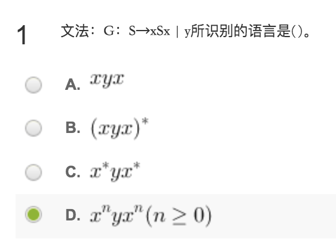
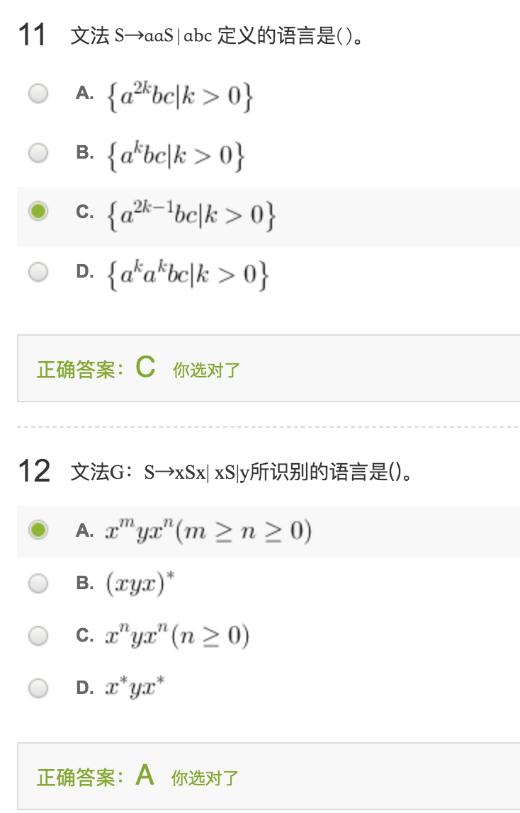
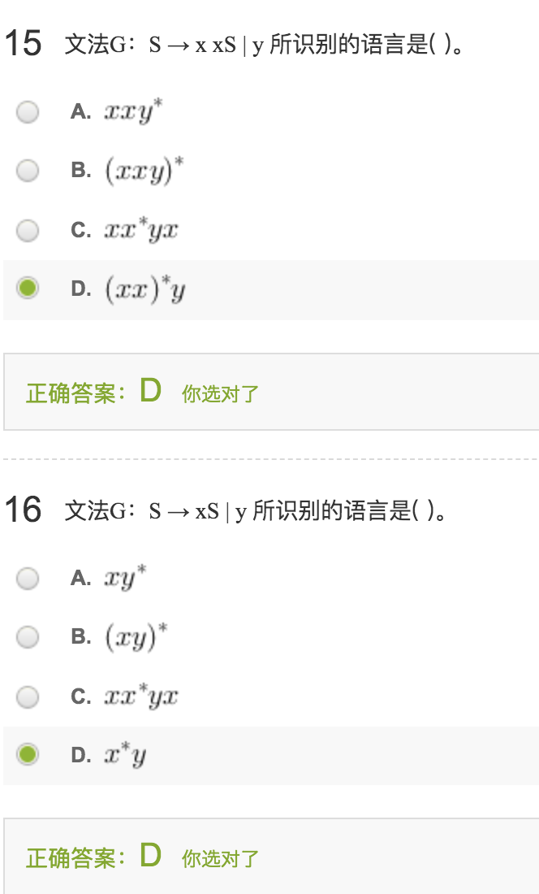

2.给定文法A→bA|ca，为该文法句子的是( )。

- A.bba
- B.cab
- **C.bca**
- D.cba

3.设有文法G[S]：S→S1|S0|Sa|Sc|a|b|c，下列符号串中是该文法的句子有( )。

- A.ab0
- B.a0b01
- C.a0b0a
- **D.bc10**

4.文法G产生的( )的全体是该文法描述的语言。

- A.句型
- B.终结符集
- C.非终结符集
- **D.句子**

5.若文法G定义的语言是无限集，则文法必然是( )。

- **A.递归的**
- B.上下文无关的
- C.二义性的       
- D.无二义性的

6.乔姆斯基(Chomsky)把文法分为四种类型，即0型、1型、2型、3型。其中3型文法是( )。

- A.非限制文法
- **B.正则文法**
- C.上下文有关文法
- D.上下文无关文法

7.一个上下文无关文法G包括四个组成部分，它们是一组非终结符号，一组终结符号，一个开始符号，以及一组( )。

- A.句子       
- **B.产生式**
- C.单词
- D.句型

8.一个文法是递归的，则它所产生的语言的句子( )。

- **A.是无穷多个**
- B.是有穷多个
- C.是可枚举的
- D.个数是常量

9.定文法A→bA|cc，则符号串①cc ②bcbc ③bcbcc ④bccbcc ⑤bbbcc中，是该文法句子的是( )。

- A. ①
- B.③④⑤
- C.②④
- **D.①⑤**

10.文法E→E+E|E\*E|i的句子i\*i+i\*i有( )棵不同的语法树。

- A.1
- B.3
- **C.5**
- D.7

13.由文法的开始符号出发经过若干步（包括0步）推导产生的文法符号序列称为( )。

- A.语言
- **B.句型**
- C.句子
- D.句柄

14.下列符号串不可以由符号集S＝{a,b}上的正闭包运算产生的是( )。

- **A.ε**
- B.a
- C.aa
- D.ab

