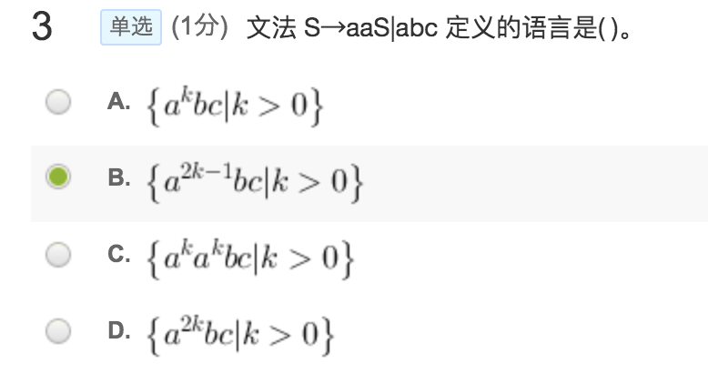
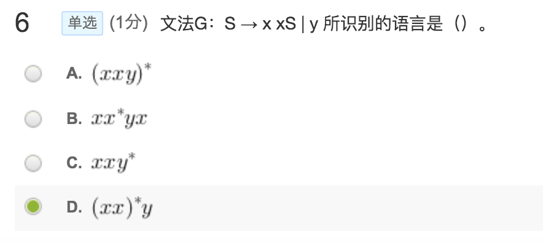

1【单选(1分)】设有文法G[S]：S→S1|S0|Sa|Sc|a|b|c，下列符号串中是该文法的句子有( )。

- A.a0b0a
- B.ab0
- C.a0b01
- **D.bc10**

2【单选(1分)】一个上下文无关文法G包括四个组成部分，它们是一组非终结符号，一组终结符号，一个开始符号，以及一组( )。

- A.单词
- **B.产生式**
- C.句子       
- D.句型

4【单选(1分)】由文法的开始符号出发经过若干步（包括0步）推导产生的文法符号序列称为( )。

- **A.句型**
- B.句柄
- C.句子
- D.语言

5【单选(1分)】下列符号串不可以由符号集S＝{a,b}上的正闭包运算产生的是（ ）。

- A.a
- B.aa
- C.ab
- **D.ε**

